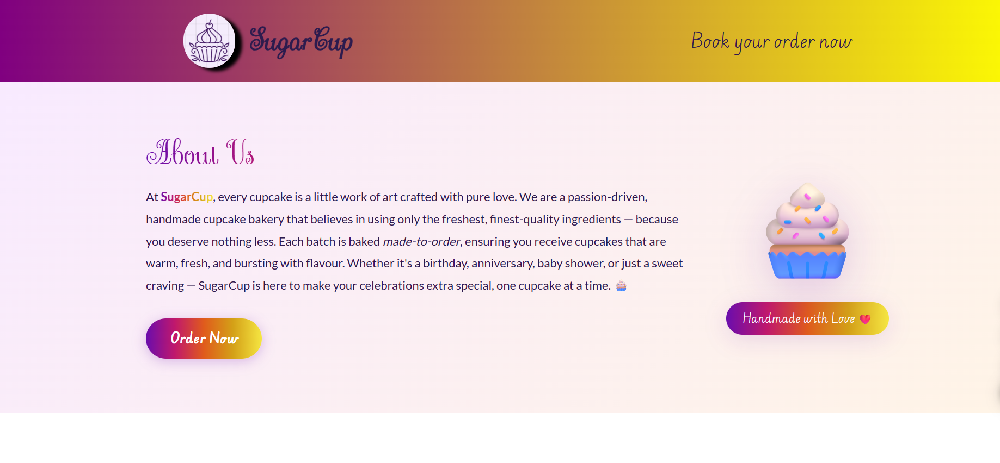

# SugarCup Landing Page

A modern, responsive landing page for **SugarCup**, a handmade cupcake bakery. The page includes a bakery introduction, cupcake menu, gallery, testimonials, and an order form.

## Preview



## Features

- Responsive bakery landing page design
- About Us section
- Cupcake menu with flavors and prices
- Product gallery
- Customer testimonials
- Order form with client-side success message
- Smooth-scrolling navigation
- Font Awesome icons

## Technologies Used

- HTML5
- CSS3
- JavaScript
- Font Awesome

## Project Files

```text
SugarCup Landing Page/
├── coming_soon.html
├── style.css
├── screenshot.png
├── logo.png
├── cupcakes.jpeg
├── cupcake_chocolate.png
├── cupcake_redvelvet.png
├── cupcake_vanilla.png
├── cupcake_caramel.png
├── cupcake_strawberry.png
└── cupcake_lemon.png
```

## Run Locally

1. Clone the repository:

   ```bash
   git clone https://github.com/Shibu09-tech/Web-Development-Learning.git
   ```

2. Open the project folder:

   ```bash
   cd Web-Development-Learning/SugarCup\ Landing\ Page
   ```

3. Open `coming_soon.html` in your browser.

Alternatively, start a local server from the repository root:

```bash
python -m http.server 8000
```

Then visit:

```text
http://localhost:8000/SugarCup%20Landing%20Page/coming_soon.html
```

## Author

[Shibu09-tech](https://github.com/Shibu09-tech)
